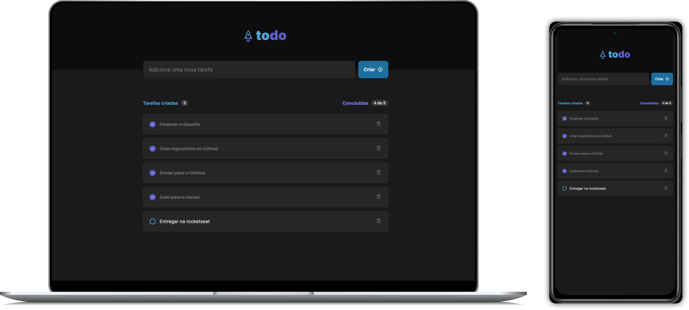

# Projeto Todo | Rocketseat

Neste projeto, desenvolvi uma aplicação ToDo que permite listar, concluir e excluir tarefas.

### Veja o projeto online

🚀 [Link do projeto online](https://react-todo-rocketseat.vercel.app/)

### Tecnologias Utilizadas

- React com Vite: ^18.2.0

### Funcionalidades

- Cadastrar uma tarefa
- Alterar o estado de uma tarefa entre não concluída e concluída
- Excluir uma tarefa

### Como Executar o Projeto

1. Clone o repositório:

   ```bash
   git clone https://github.com/fabiocasadossites/react-todo-rocketseat.git
   ```

2. Navegue até o diretório do projeto:

   ```bash
   cd nome-do-repositorio
   ```

3. Atualize o projeto, Em seu terminal e na pasta do projeto

   ```bash
   npm install
   ```

4. Rodar o projeto

   ```bash
   npm run dev
   ```

<br>

## 👨‍💻 Expert

<p>
    
    <p>&nbsp&nbsp&nbspFabio Augusto<br>
    &nbsp&nbsp&nbsp
    <a href="https://github.com/fabiocasadossites">
    GitHub</a>&nbsp;|&nbsp;
    <a href="https://www.linkedin.com/in/fabioasa/">LinkedIn</a>
&nbsp;|&nbsp;
    <a href="https://www.fabioaugusto.dev/">
    Portfolio </a>
&nbsp;&nbsp;</p>
</p>
<br/>
<p>

💻 com ❤️ por [Fabio Augusto](https://github.com/fabiocasadossites)
